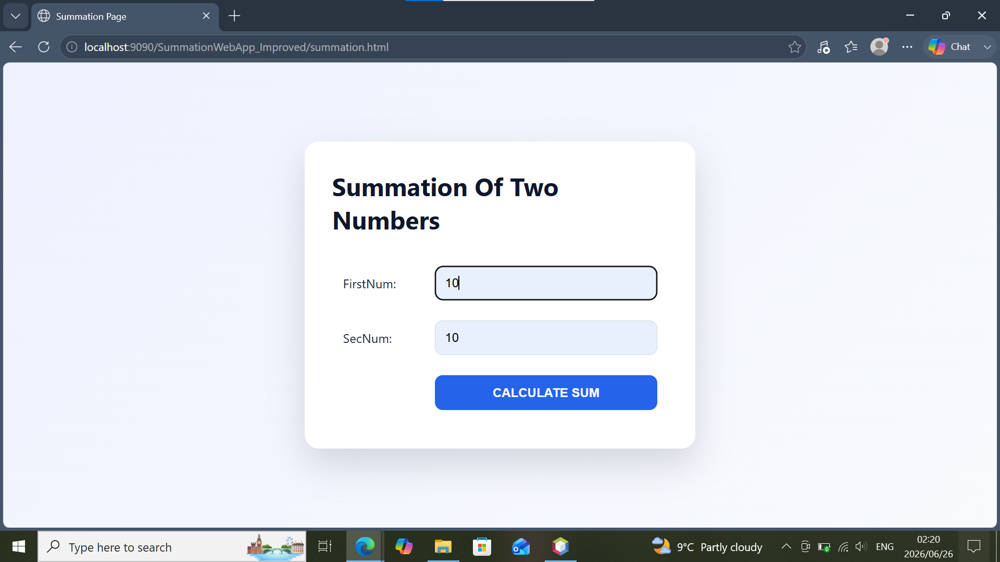
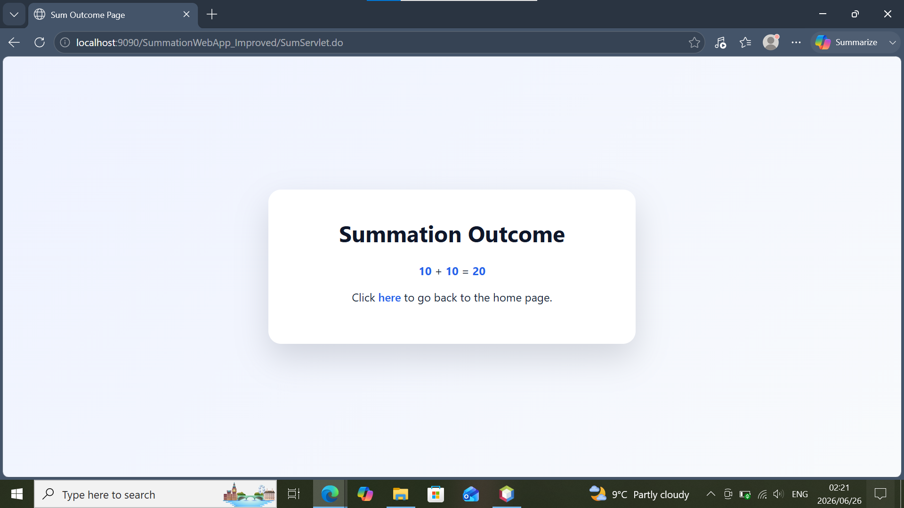

# 🧮 Summation Web App

A Java-based web application that allows users to enter two numbers and calculate their sum.  
This project demonstrates the use of **Java Servlets, JSP, HTML, and CSS** to create a simple interactive web application.

---

## 📌 Project Description

The **Summation Web App** is a beginner-friendly Java web application developed using NetBeans.  

Users can input two values through a web interface, submit the form, and the application processes the request using a Java Servlet before displaying the calculated result.

---

## 🚀 Features

✅ User-friendly interface  
✅ Accepts two numbers as input  
✅ Calculates the total automatically  
✅ Displays results dynamically  
✅ Clean and responsive design  
✅ Java Servlet backend processing  
✅ JSP result page  
✅ MVC-inspired project structure  

---

## 🖼️ Screenshots


### Home Page




### Result Page




---

## 🛠️ Technologies Used

### Backend
- Java
- Java Servlets
- JSP (JavaServer Pages)

### Frontend
- HTML5
- CSS3

### Development Tools
- NetBeans IDE
- Apache Ant
- GlassFish Server

---

## 📂 Project Structure

```
SummationWebApp
│
├── src
│   └── java
│       └── za.ac.tut
│           │
│           ├── model
│           │   └── SumCalculator.java
│           │
│           └── web
│               └── SumServlet.java
│
├── web
│   │
│   ├── index.html
│   ├── summation.html
│   ├── sum_outcome.jsp
│   │
│   ├── css
│   │   └── style.css
│   │
│   └── WEB-INF
│       └── web.xml
│
└── build.xml
```

---

## ⚙️ How To Run The Project

### Requirements

Before running the project install:

- Java JDK
- NetBeans IDE
- GlassFish Server

---

### Steps

1. Clone the repository:

```bash
git clone https://github.com/yourusername/SummationWebApp.git
```

2. Open NetBeans

3. Select:

```
File → Open Project
```

4. Choose the project folder

5. Configure GlassFish Server

6. Run the project

7. Open it in your browser

---

## 📚 Learning Objectives

This project demonstrates:

- Creating Java Web Applications
- Handling HTTP requests with Servlets
- Passing data between HTML and Java
- Using JSP for dynamic pages
- Applying CSS styling
- Structuring a NetBeans Java project

---

## 🔮 Future Improvements

Possible upgrades:

- Add multiplication, subtraction, and division
- Add user input validation
- Add calculation history
- Improve UI animations
- Add database storage
- Deploy online

---

## 👨‍💻 Author

**Sabelo Malusi Zwane**


